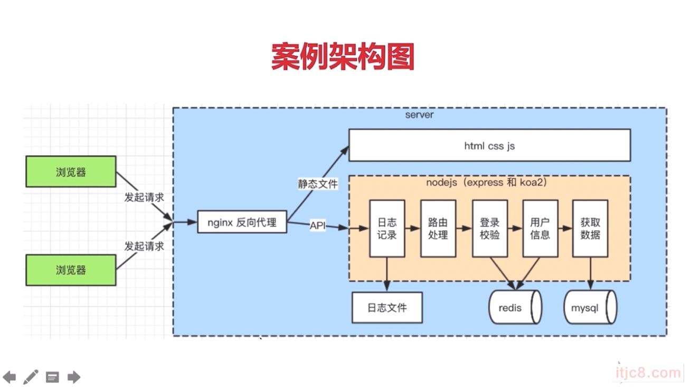

### Nodejs的用途
- Nodejs为js的一个运行环境
- 运行在服务端，作为web server
- 运行在本地，作为打包,构建工具

### 主要困惑
- 前端和服务端开发思路的转型问题
- API开发，数据存储，登入，日志，安全
- http stream session mysql redis, nginx, pm2

### 知识点介绍

###  系统架构

### 区分ES和JS和Nodejs

#### ES

- es6.ruanyifeng.com

- 定义了语法，写JS和nodejs必须遵守
- 定了变量，循环，判断，函数
- 原型和原型链，作用域和闭包，异步
- 不能够操作DOM，不能够监听click，不能够发送ajax，不能文件处理，不能处理http 几乎做不了实际的项目

#### JS

- 使用ES语法规范，外加web API （w3c）
- DOM操作，BOM操作，时间绑定，ajax
- 两者结合完成浏览器的操作

#### nodejs

- 使用es规范，外加nodejs API
- 处理http请求，文件处理
- 两者将结合，完成server端的操作

### server端
- 服务端的稳定性 => 使用PM2来做进程守候，能够自动重启该程序
- 考虑内存和CPU(优化，和扩展) => redis存储session和stream写日志
- 日志记录 （恢复，debug）多种日志的记录方式
- 安全性的最后保障
- 集群和服务拆分（程序的可扩展性）

### 博客项目

#### 项目

- 博客系统基础功能：CURD
- 只关心server端的API

#### 需求

- 首页，作者主页，博客详情页

- 登入页

- 管理中心，新建页，编辑页

- 需求一定要明确，需求指导开发
- 不要纠结于页面样式，并不影响server的复杂度

#### 技术方案